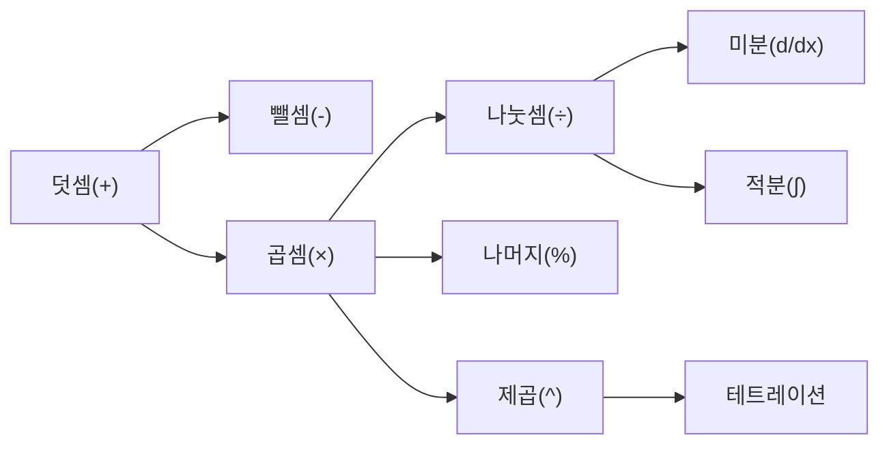

# 연산자

## 덧셈 (+)
* 설명 생략

## 뺄셈 (-)
* 덧셈의 역연산.
* 수직선을 그렸을 때 덧셈의 반대방향으로서 잘 드러난다.

## 곱셈 (×)
* 덧셈의 반복.

## 나눗셈 (÷)
* 곱셈의 역연산

## 나머지 (%)
* mod로 사용됨. (modulo의 약자)
* 몫-나머지 연산 중 나머지를 반환.

## 제곱 (^)
* 윗첨자로 사용됨.
* 곱셈의 반복.
* 역원(제곱근)은 제곱으로 표현 가능.

### 테트레이션
* 곱셈 / 테트레이션의 반복

## 기타
* TODO: 미분, 적분