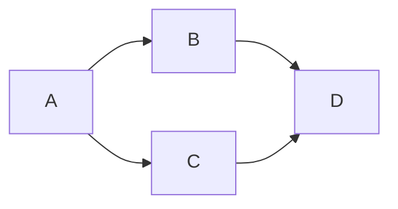

# mermaid
* markdown에서 mermaid를 사용하여 다이어그램 그리기.
* [Docusaurus 참고](https://docusaurus.io/docs/markdown-features/diagrams)
* [Docusaurus 문서](https://docusaurus.io/docs/markdown-features/diagrams)
* [Mermaid 문법](https://mermaid.js.org/intro/syntax-reference.html)
* [Mermaid 테마](https://mermaid.js.org/config/theming.html)

## 예제 코드
````

````
### 결과

