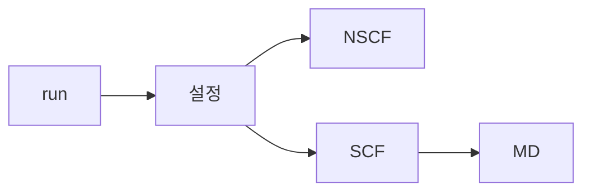

# 전체 흐름도

### 설정
* 계산을 위한 설정을 수행한다.
    * 파일 읽기, 변수 할당 및 설정, 병렬화 설정, 정보 출력 등.
* NSCF 및 SCF 계산을 위한 초기 계산을 수행한다.
### NSCF
* Non-SCF 계산을 수행한다.
### SCF
* SCF 계산을 수행한다.
### MD
* Molecular Dynamics
* SCF 계산 결과를 기반으로 구조를 변화시킨다.
#### relax
* Relaxation
* 최적화하는 방향으로 변화.
#### md
* Molecular Dynamics
* 시간 진행.
#### vc-relax / vc-md
* Variable Cell
* 원자 위치 뿐만 아니라 셀 구조도 변형.