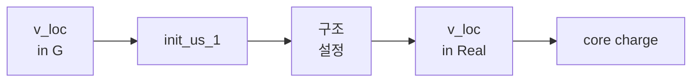

* Kohn-Sham Equation에서 포텐셜은 다음과 같다.  
$V_\text{eff}(r)=V_\text{ext}(r)+V_H(r)+V_{xc}(r)$



## V_loc in G
* file: init_vloc / vloc_mod (vloc_of_g)
* <Glossary id="PP"/>의 local part의 Fourier Transform을 계산한다.
* PP에는 여러 form이 존재.
  * analytic form과 numeric form에 대해 구현됨.
  * PP와 동일한 form의 fourier transform을 계산.
  * US(UltraSoft)PP의 경우 항상 numeric form이다.
* $V^\text{PP}_\text{short}$는 interpolation table로부터 구한다.
### V_short
$\large \text{aux}_1=r\cdot V^\text{PP}_\text{local}(r)+Z_p\cdot e^2\cdot\text{erf}(r)$  
$\large \text{aux}=\text{aux}_1\frac{\sin(|\vec G|r)}{|\vec G|}$  
$\large V^\text{PP}_\text{short}(\vec G)=\frac{4\pi}{\Omega}\int[\text{aux}]dr$
```fortran
DO ir = 1, msh(nt)
  aux1 = r*upf(nt)%vloc(ir) + upf(nt)%zp*e2*erf(r)
  aux (ir) = aux1 * sin(q*r)/q
END DO
CALL simpson ( msh(nt), aux, rgrid(nt)%rab, tab_vloc(iq,nt) ) ! simpson integration
tab_vloc (iq,nt) = tab_vloc (iq,nt) * fpi / omega 
```
### V_long
$\large V^\text{PP}_\text{long}(\vec G)=-\frac{4\pi Z_p e^2}{\Omega}\frac{\exp[-G^2/4]}{G^2}$
```fortran
fac = fpi / omega * upf(nt)%zp * e2 / tpiba2
... ! tpiba2: unit conversion
... - fac * exp ( - gl (igl) * tpiba2 * 0.25d0) / gl (igl)
```

### V_loc
$\large V^\text{PP}_\text{loc}(\vec G)=V^\text{PP}_\text{short}(\vec G)+V^\text{PP}_\text{long}(\vec G)$
```fortran
DO igl = igl0, ngl
  ... ! compute V_short
  vloc(igl) = ... ! compute V_long, sum short and long term
END DO
```

## init_us_1
* TODO

## 구조 설정
### read_conf
* restart mode의 경우
* 원자 위치 및 셀 구조를 기존 계산 결과로부터 읽어온다. (xml 파일에 저장됨.)
### struc_fact
* FFT Grid와 각 원자의 Phase 계산

## V_loc in R
* file: setlocal / fft_rho

strf: $\large S_\tau(\vec G)=\sum_\tau{\exp[-i\vec G\cdot\vec\tau]}$  
$\large V^\text{PP}_\text{loc}(\vec G)=\frac{S_\tau(\vec G)}{\Omega}\int_\infty{V^\text{PP}_{\text{loc,}\tau}(\vec r)e^{-i\vec G\cdot\vec r}}d^3\vec r$
```fortran
DO nt = 1, ntyp
  aux(1:ngm) = aux(1:ngm) + vloc(igtongl(1:ngm),nt) * strf(1:ngm,nt)
END DO
CALL invfft('Rho', aux, dfftp)
vltot(:) = DBLE(aux(:))
```

## core charge
* file: set_rhoc
* G 공간에서 core charge 계산 및 R공간으로 FFT
* (TODO: 수식 재확인 요망.)
```fortran
DO nt = 1, ntyp
   IF ( upf(nt)%nlcc ) THEN
      CALL interp_rhc (nt, ngl, gl, tpiba2, rhocg)
      DO ng = 1, ngm
         rhog_core(ng) = rhog_core(ng) + strf(ng,nt) * rhocg(igtongl(ng))
      END DO
   END IF
END DO
CALL rho_g2r( dfftp, rhog_core, rho_core )
```
$\large\rho_\text{core}(\vec G)=\sum_\text{Z}S_\tau(\vec G)\cdot\rho_{\text{core,Z}}(G)$  
$\large\rho_\text{core}(\vec r)=\frac{1}{\Omega}\sum_{\vec G}{\rho_\text{core}(\vec G)\exp[i\vec G\cdot\vec r]}$