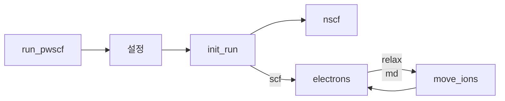

# 전체 흐름도

```mermaid
graph LR;
    run_pwscf-->설정-->B[init_run];
    B-->nscf;
    B-->|scf|C[electrons]-->|relax<br>md|D[move_ions];
    D-->C;
```
### 설정
* 계산을 위한 설정을 수행한다.
* 파일 읽기, 변수 할당 및 설정, 병렬화 설정, 정보 출력 등.
### NSCF
* non-SCF 계산을 수행한다.
### electrons
* SCF 계산을 수행한다.
### move_ions
* SCF 계산 결과를 기반으로 구조를 변화시킨다.
